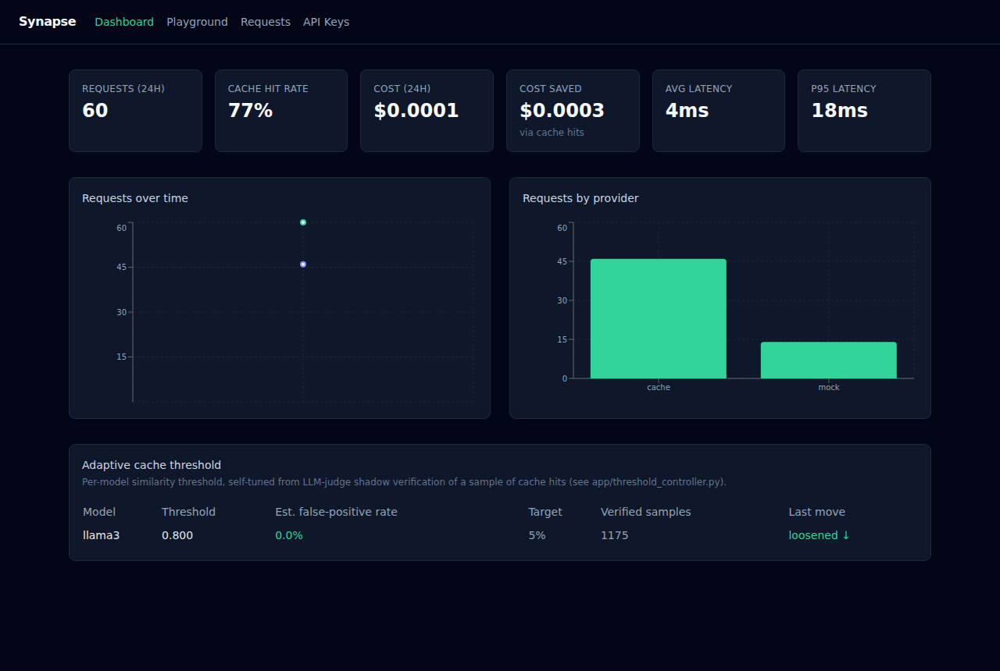
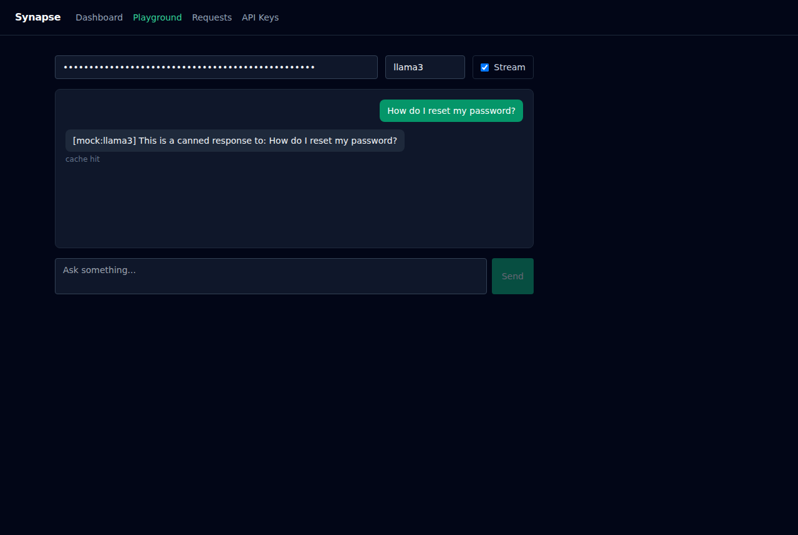
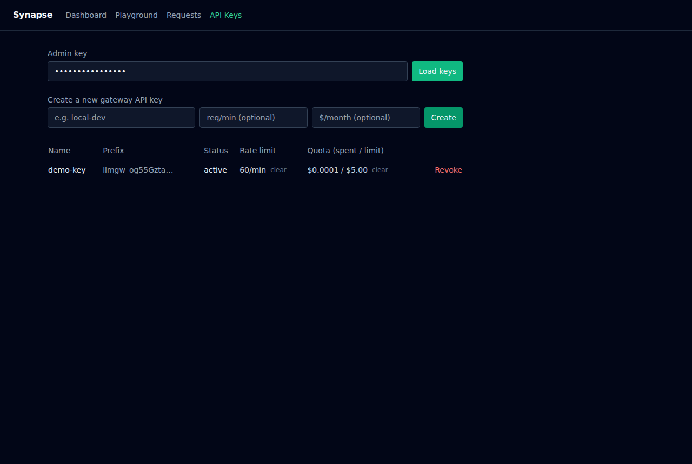

# Synapse

[](https://github.com/arvindxyogesh/Synapse/actions/workflows/ci.yml)
[](LICENSE)

A self-hosted LLM gateway you drop in front of your app with a one-line
change. Point the **real `openai` SDK** (Python or JS, unmodified) at your
Synapse instance instead of api.openai.com, and you get semantic response
caching, cost/latency tracking, per-key rate limits and quotas, and a live
observability dashboard — for open-weight models served locally, for free,
fully self-hosted, no data leaving your own infrastructure. The serving
backend is pluggable (`PROVIDER=ollama|vllm`): [Ollama](https://ollama.com)
runs on CPU with zero setup and is the default demo path, or point it at
[vLLM](https://github.com/vllm-project/vllm) for GPU-served throughput
(continuous batching, PagedAttention) once you have a real workload.

```python
import openai

client = openai.OpenAI(
    api_key="llmgw_...",                    # a Synapse gateway key, see Quickstart
    base_url="http://localhost:8000/v1",    # <- the only line that changes
)

resp = client.chat.completions.create(
    model="llama3",
    messages=[{"role": "user", "content": "hello"}],
)
print(resp.choices[0].message.content)
# send the exact same request again: cost $0, latency in single-digit ms,
# served from Synapse's semantic cache instead of hitting the model again
```

That's not a claim about shape-compatibility — `tests/test_openai_compat.py`
runs the actual `openai` Python package against the app and asserts on its
typed response objects, both for regular calls and streaming.

## What makes this different from LiteLLM Proxy / Portkey / Helicone

Those are mature, production-grade projects — this is a from-scratch,
fully self-hosted reference implementation, not a drop-in replacement for
any of them. Where it's distinctive: its semantic cache doesn't trust a
single fixed similarity threshold. A **closed-loop controller**
continuously shadow-verifies a sample of cache hits against an independent
LLM-judge and adjusts the threshold online to hold a target false-positive
rate — see [Adaptive cache threshold](#adaptive-cache-threshold-self-tuning-correctness)
below, including honestly-reported results (what held up, what didn't,
bugs found along the way) rather than just a claim that it works.

| | Synapse | LiteLLM Proxy / Portkey / Helicone |
|---|---|---|
| OpenAI-compatible endpoint | ✅ | ✅ |
| Self-hosted, open source | ✅ | Partially (OSS core + hosted/paid tiers) |
| Semantic response caching | ✅ (ANN vector search) | Some support exact-match caching |
| Self-tuning cache correctness | ✅ | ❌ (not aware of this in any of them) |
| Maturity / production track record | Portfolio-stage | Production-grade, widely deployed |

```
                 ┌─────────────┐        ┌──────────────┐
  client  ─────▶ │   FastAPI    │──────▶ │ Ollama / vLLM │  (local, free,
 (API key)       │   gateway    │        │ open models   │   open-weight,
                 │ rate limits  │◀───────┤ llama3/mistral│  PROVIDER=...)
                 │ + quotas     │        └──────────────┘
                 └───┬──────┬───┘
                     │      │
         semantic    │      │  request/cost/latency log
         cache (ANN) ▼      ▼
                 ┌────────┐ ┌────────────┐
                 │ Redis  │ │ Postgres   │  (Alembic-managed schema)
                 │ +vector│ └────────────┘
                 └────────┘      ▲
                     ▲            │ stats API
                     │            │
                 ┌────────────────┐
                 │ React dashboard │  live charts, chat playground
                 │  (Vite + TS)    │  (streaming), API key management
                 └────────────────┘
```

## Screenshots

<table>
<tr><td width="50%">

**Dashboard** — live request volume, cache hit rate, cost saved, latency,
and the adaptive cache-threshold panel (per-model threshold, estimated
false-positive rate vs. target, verified sample count).



</td><td width="50%">

**Playground** — chat through the gateway directly (streaming or not);
`cache hit` / `provider: ...` is shown per response, live.



</td></tr>
</table>

**API Keys** — create/revoke gateway keys, set or clear a per-minute rate
limit and monthly USD quota, see live spend against it.



## How the caching works

Every call to `POST /v1/chat/completions` is checked against a semantic
cache before it reaches the model: an exact-hash check first, then a
vector similarity search against recent embeddings for that model. A cache
hit skips inference entirely — zero cost, near-zero latency — and the
dashboard shows exactly how much that's saving in real time. Responses can
also be streamed token-by-token (SSE), and gateway keys can carry a
per-minute rate limit and a monthly cost quota.

## Adaptive cache threshold (self-tuning correctness)

A semantic cache has one structural risk: at a fixed similarity threshold,
a "close enough" match can be *wrong* -- e.g. reusing the answer to "How do
I cancel my subscription?" for "How do I pause my subscription instead of
cancelling?" is a real, damaging false positive, not just a missed
optimization. Turning the threshold up to be safe throws away hit rate;
turning it down to get more hits risks more of these.

Rather than pick one fixed threshold and hope, `app/threshold_controller.py`
tunes it online, per model, with a small closed-loop controller:

1. A sample of cache hits (`SHADOW_VERIFY_SAMPLE_RATE`, default 20%) is
   shadow-verified in the background, after the response has already been
   served (so it never adds latency): an **independent LLM-judge**
   (`app/judge.py`) is asked whether the prompt that originally produced
   the cached response and the prompt that just hit it are actually
   asking the same thing. This is a genuinely different signal from the
   embedding similarity that produced the hit in the first place, so it
   catches errors the embedding model itself missed. It falls back to a
   deterministic stopword-filtered token-overlap heuristic when there's no
   real model to ask (mock mode / configured provider unreachable) -- same
   real-model-with-deterministic-fallback shape as `app/embeddings.py`, so
   the whole thing is testable and demoable without a GPU.
2. An EWMA of the observed false-positive rate drives the threshold up
   (stricter) when it's above target, or back down (looser, more hits)
   once it's comfortably under target -- in small, bounded, cooldown-gated
   steps, the same "hold an operating metric near a target" shape as an
   SLO-adaptive controller, applied here to cache *correctness* instead of
   latency.

State and results are visible at `GET /v1/stats/cache-threshold` and on
the dashboard.

### Honest status of the evidence so far

`backend/scripts/benchmark.py --rounds` (see its docstring to reproduce)
demonstrates the *mechanism* end-to-end -- shadow verification firing,
false positives being detected, the threshold moving in response, and
recovering -- but every number produced against this environment used
`MOCK_MODE` and the **hash-embedding fallback**, not a real embedding
model: `sentence-transformers` needs to download weights from
huggingface.co on first use, which this sandbox's network policy blocks
outright (confirmed directly, not assumed -- see `app/embeddings.py`,
which now logs a warning and reports its active backend on `GET /health`
specifically because this failure used to be silent). That matters,
concretely: the benchmark also reports precision/recall on the
**"novel-only"** subset -- excludes exact-repeat prompts, which trivially
hit and inflate the headline numbers once a small traffic universe
saturates -- and on that harder, honest slice, the hash fallback's recall
on genuine differently-worded paraphrases collapses to roughly 0-40%. The
bag-of-words hash embedder mostly can't tell that "How do I reset my
password?" and "I forgot my password, how can I reset it?" mean the same
thing; only close-to-verbatim repeats reliably hit.

So: the control loop (shadow verification catching real errors, the
threshold correctly tightening/loosening in response) is verified and
reproducible. Whether it holds up with *real* embeddings and a *real*
LLM-judge -- where the interesting failure modes are different (judge
noise/inconsistency, real embeddings' own precision/recall curve) -- is
not yet measured and needs a real network + a real Ollama-served model,
i.e. GPU is optional but real network access and a real model are not.

Two real bugs were also found and fixed while building this (not just the
network-blocked one above): an EWMA tuned too fast (alpha=0.3, ~3-sample
memory) silently underestimated a real ~15% false-positive rate down to
~0%, and the benchmark harness's own ground truth mislabeled repeated
confuser prompts as false positives. Both fixed in the current code.

### Update: real GPU + real model results

Re-ran on real hardware (8x H200, real network, real `llama3.1:8b` via
Ollama, real `sentence-transformers` embeddings, real LLM-judge) instead
of the mock/hash-fallback setup above. `GET /health` confirmed
`"embedder_backend": "sentence-transformers"` -- the real model, not the
fallback.

- **Cold start vs. warm inference matters a lot and is easy to misreport.**
  The very first request took 53.4s (one-time model load into VRAM); the
  next three distinct (uncached) prompts averaged ~470ms. Only the warm
  number is representative -- reporting the cold-start figure as "typical
  latency" would have been misleading.
- **Precision held up under a real LLM-judge**, not just the heuristic
  fallback: 98-100% across 6 rounds of a real convergence run, with the
  threshold correctly climbing (0.60 → 0.85) in response to real
  shadow-verified false positives.
- **Recall on genuinely-novel paraphrases (the `novel_only` metric) was
  low and declining under the default target false-positive rate (5%)**:
  70% → 31% → 21% → 0% → 12.5% → 12.5% across rounds. This is the
  precision/recall tradeoff working as intended, not a bug -- holding a
  tight false-positive budget costs recall on real paraphrases -- but it
  means headline numbers like "122x speedup" from that run are earned
  substantially by exact-repeat traffic, not broad semantic
  generalization. A less repetitive production workload would likely see
  real hit rate (and therefore real savings) meaningfully lower than that.
- **An open question surfaced, not yet resolved**: aggregate cache-miss
  latency in that run (1671ms) was ~3.5x higher than the manually-measured
  warm baseline (~470ms), while `SHADOW_VERIFY_SAMPLE_RATE` was set to
  100% for a fast convergence demo. Leading hypothesis: background
  LLM-judge calls (real Ollama inference) were competing with regular
  requests for the same model-serving slot, so "background" shadow
  verification wasn't actually latency-free once it shared a bottleneck
  with the request path. A follow-up run at the default 20% sampling rate
  should confirm or rule this out -- not yet done as of this writing.

### Update: real vLLM results (`PROVIDER=vllm`)

Ran the same kind of validation against a real vLLM server instead of
Ollama, on an H200-class GPU on the same machine as the run above, serving
`Qwen/Qwen2.5-1.5B-Instruct` via `vllm serve` (see the environment note
below for why not Docker), fronted by the gateway with `PROVIDER=vllm`.

**End-to-end wiring confirmed manually first**: a `/v1/chat/completions`
call returned `"provider":"vllm"`, a real completion, real usage (30
prompt / 10 completion tokens), and 4396ms latency (first-request vLLM
warmup -- the same cold-start effect noted above, just smaller since the
model was already resident from `vllm serve` startup). The identical
request repeated came back `"provider":"cache"`, `"cached":true`,
`cost_usd: 0.0`, 1.77ms -- roughly a 2500x latency drop on that one pair.

**`backend/scripts/benchmark.py`, 150 requests, single round, default
config** (no stress-test threshold/sampling overrides, unlike the 6-round
Ollama convergence demo above):

- Precision 100%, recall 74%, F1 85.1% (TP=77, FP=0, FN=27, TN=46);
  adaptive threshold moved 0.92 → 0.910 (14 shadow-verified samples, 0
  false positives found).
- **Novel-only recall collapsed to 12.9%** (4 of 31 novel true positives)
  -- the same shape as the Ollama run's finding above, now reproduced with
  a different serving engine *and* a much smaller model (1.5B vs 8B):
  headline hit-rate numbers are earned substantially by exact-repeat
  traffic, not broad semantic generalization.
- Avg cache-miss latency 621ms, cache-hit 34ms (18.3x speedup on a hit),
  51.3% cost reduction.

**An open question, stated rather than smoothed over**: cache-miss latency
here (621ms, a 1.5B model on vLLM) was *higher* than the Ollama run's warm
baseline (~470ms, an 8B model) despite the much smaller model. This run
doesn't distinguish between the plausible explanations -- vLLM engine
overhead at this traffic pattern, a different physical GPU than the one
used for the Ollama run, warmup not fully settled when the benchmark
started -- so it's reported as an open question, not a claim either engine
is faster. A controlled back-to-back comparison (same model, same GPU,
both engines) is the natural follow-up and hasn't been done.

**Environment note**: no Docker was available for this run (no root access
on the shared host, and the daemon happened to be down) -- vLLM ran as a
plain `vllm serve` process instead of the `docker-compose.yml` service,
and Redis was swapped for `backend/scripts/run_fake_redis.py`'s
pure-Python fake server. Both are fallback paths this repo already
documents (see `docker compose`'s optional `vllm` profile and the
Stack table's SQLite note above), not special accommodations invented for
this run.

## Stack

| Layer | Tech |
|---|---|
| Model serving | Pluggable via `PROVIDER`: [Ollama](https://ollama.com) (default, CPU) or [vLLM](https://github.com/vllm-project/vllm) (GPU, OpenAI-compatible), with an automatic mock-provider fallback |
| Backend | FastAPI, SQLAlchemy, Alembic |
| Cache | Redis, with ANN vector search (Query Engine / RediSearch) when available, falling back to a linear scan otherwise |
| Cache correctness | Adaptive per-model similarity threshold, tuned online by LLM-judge shadow verification |
| Embeddings | [sentence-transformers](https://www.sbert.net/) (local, falls back to a hashing embedding if unavailable) |
| Storage | Postgres (SQLite for local dev without Docker) |
| Frontend | React + TypeScript (Vite), Tailwind CSS, Recharts |
| CI | GitHub Actions (ruff + pytest, eslint + tsc + vite build) |

## Quickstart

### Option A — Docker Compose (Postgres + Redis + backend + frontend)

```bash
cp .env.example .env
docker compose up --build
```

- Dashboard: http://localhost:5173
- API: http://localhost:8000 (docs at `/docs`)

`docker compose` runs `redis/redis-stack-server`, which bundles the Query
Engine module the semantic cache uses for ANN vector search, and the
backend image runs `alembic upgrade head` on startup before serving traffic.

If the configured provider isn't running locally, the gateway automatically
serves mock responses instead of erroring out — you can still exercise the
whole cache/cost/dashboard pipeline with zero model setup. To use real
open-weight models with the default backend: `ollama pull llama3` then
`ollama serve`.

To use vLLM instead (needs a CUDA GPU): set `PROVIDER=vllm` in `.env`, then
either run `vllm serve <model> --port 8001` yourself, or bring up the
optional GPU-profiled compose service: `docker compose --profile vllm up`
(set `VLLM_MODEL` in `.env` to pick the model; defaults to a small
Llama 3.2 instruct model). vLLM speaks the OpenAI chat-completions format
natively, so `VLLMProvider` (`app/providers.py`) is close to passthrough —
see it for exact-usage-token reporting via `stream_options.include_usage`.

### Option B — run backend/frontend directly

```bash
# backend
cd backend
python -m venv .venv && source .venv/bin/activate
pip install -r requirements.txt
alembic upgrade head   # creates ./gateway.db (SQLite) via migrations
uvicorn app.main:app --reload

# frontend (separate terminal)
cd frontend
npm install
npm run dev
```

Plain `redis-server` (no Query Engine module) works fine here too — the
cache detects the module is missing and transparently falls back to a
linear-scan similarity search.

### Try it

```bash
# 1. create a gateway API key (ADMIN_KEY defaults to "change-me-admin-key").
#    rate_limit_per_minute / monthly_quota_usd are both optional (omit or
#    null = unlimited).
curl -X POST localhost:8000/v1/admin/keys \
  -H "x-admin-key: change-me-admin-key" \
  -H "Content-Type: application/json" \
  -d '{"name": "local-dev", "rate_limit_per_minute": 60, "monthly_quota_usd": 5}'
# -> {"api_key": "llmgw_..."}

# 2. send a chat completion through the gateway
curl -X POST localhost:8000/v1/chat/completions \
  -H "Authorization: Bearer llmgw_..." \
  -H "Content-Type: application/json" \
  -d '{"model": "llama3", "messages": [{"role": "user", "content": "hello"}]}'

# 3. send the exact same request again -> "cached": true, cost_usd: 0, x-cache: hit

# 4. or stream it token-by-token (Server-Sent Events, OpenAI-chunk shaped)
curl -N -X POST localhost:8000/v1/chat/completions \
  -H "Authorization: Bearer llmgw_..." \
  -H "Content-Type: application/json" \
  -d '{"model": "llama3", "messages": [{"role": "user", "content": "hello"}], "stream": true}'
```

Then open the dashboard to watch request volume, cache hit rate, cost
saved, and latency update live, use **Playground** to chat through the
gateway directly (streaming or not), and **API Keys** to create/revoke keys
and set or clear their rate limit and quota.

Exceeding a key's rate limit or quota returns `429` (rate limit responses
carry a `Retry-After` header).

## Tests

```bash
cd backend && pip install -r requirements-dev.txt && ruff check app tests && pytest
cd frontend && npm install && npm run lint && npm run build
```

Both run in CI on every push (`.github/workflows/ci.yml`). Tests build
their schema straight from the SQLAlchemy models (no Alembic involved) and
run against fakeredis, so the ANN cache branch is covered separately with a
mocked Redis client (`tests/test_cache_ann.py`) since fakeredis doesn't
implement the vector search commands. `tests/test_openai_compat.py` runs
the real `openai` SDK against the app in-process (via httpx's ASGI
transport) to verify drop-in compatibility, not just a schema comparison.

## Project layout

```
backend/
  alembic/            migrations (env.py reads DATABASE_URL from Settings)
  app/
    main.py           FastAPI app + router wiring
    providers.py       Ollama + vLLM clients, pluggable via PROVIDER, with
                        mock fallback, incl. streaming
    cache.py           semantic cache: exact match, ANN vector search
                        (Redis Query Engine) with linear-scan fallback
    embeddings.py      sentence-transformers embedder + hashing fallback
    threshold_controller.py  adaptive per-model cache similarity threshold
    judge.py            LLM-judge (+ heuristic fallback) shadow verification
    background.py       fire-and-forget helper for shadow verification
    pricing.py         cost estimation per model
    auth.py            API key issuance/verification
    ratelimit.py        per-key rate limiting (req/min) + monthly $ quotas
    redis_client.py     shared Redis connection (cache + rate limiter)
    api/
      gateway.py       POST /v1/chat/completions (streaming + non-streaming)
      admin.py         API key CRUD + rate limit/quota updates (admin-key protected)
      stats.py         summary / timeseries / provider breakdown / request log
                        + cache-threshold (adaptive controller state)
  tests/
  scripts/
    benchmark.py       cache precision/recall/F1 vs a live gateway, with
                        --rounds to show the adaptive threshold converging
frontend/
  src/
    pages/             Dashboard (incl. adaptive threshold panel),
                        Playground (live chat), Requests, ApiKeys
    api/client.ts      typed fetch wrapper
```

## Notes / possible next steps

Highest-value next step, concretely: re-run
`backend/scripts/benchmark.py --rounds` at `SHADOW_VERIFY_SAMPLE_RATE=0.2`
(the realistic default, vs. the 100% used for the fast convergence demo
above) against the same real Ollama + real embeddings setup, and compare
aggregate cache-miss latency to the ~470ms warm baseline -- confirms or
rules out the background-judge-contention hypothesis in the "Update: real
GPU + real model results" section above.

Other next steps:
- Swap linear TTL-window rate limiting for a sliding-window/token-bucket
  algorithm if bursts right at the minute boundary start to matter.
- vLLM support landed (`PROVIDER=vllm`, `app/providers.py`'s `VLLMProvider`)
  and is now validated against a real vLLM server too, not just the mocked
  transport in `tests/test_providers_vllm.py` -- see "Update: real vLLM
  results" above. What that run didn't settle: a controlled back-to-back
  comparison against Ollama (same model, same GPU, both engines) to
  actually attribute the latency difference it surfaced, rather than the
  different-model/possibly-different-GPU comparison done so far. Further
  providers (llama.cpp server, etc.) would slot into the same
  `BaseProvider` shape.
- Alerting on quota/rate-limit thresholds instead of just blocking at 100%.
- A controlled ANN-vs-linear-scan latency/throughput benchmark as cache
  size grows (1k/10k/100k entries) -- the vector index exists (and was
  exercised for real via `redis/redis-stack-server` in the GPU run above),
  but its payoff at scale isn't measured yet.
- Load/concurrency testing (p50/p95/p99 under N concurrent users) against
  real GPU-served Ollama, informed by whatever the shadow-verify
  contention follow-up above finds.
- Revisit `target_false_positive_rate` (currently 5%): the real-GPU run
  showed a real precision/recall tradeoff at that setting -- worth
  measuring whether a looser target (e.g. 10%) recovers meaningfully more
  `novel_only` recall without letting precision slip further than
  acceptable.

## Contributing

See [CONTRIBUTING.md](CONTRIBUTING.md) — setup, test commands, and code
style all in one short doc. Issues and PRs welcome.

## License

[MIT](LICENSE).
