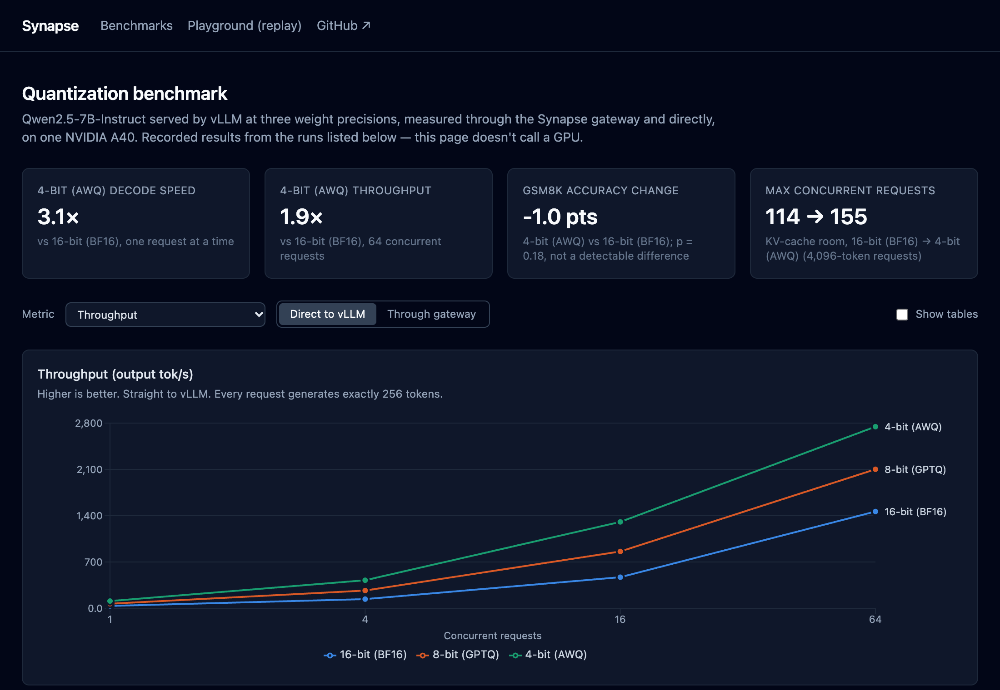
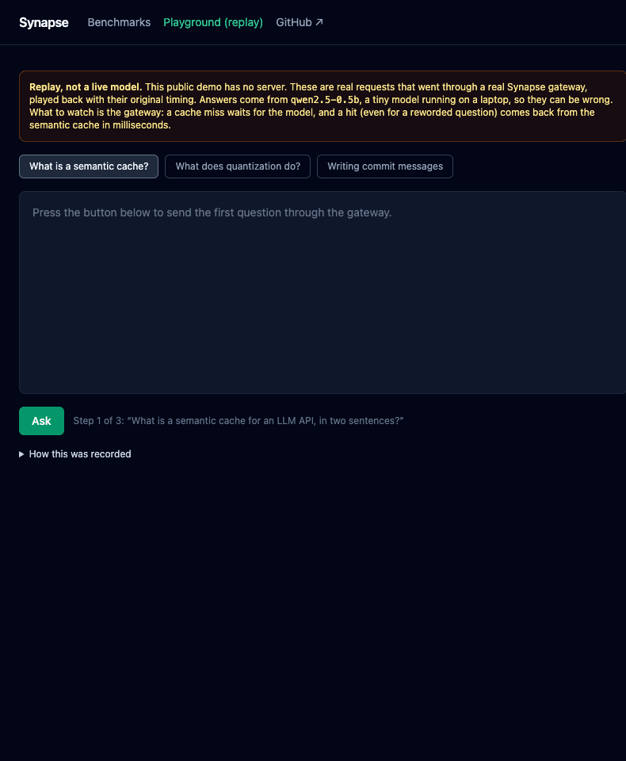
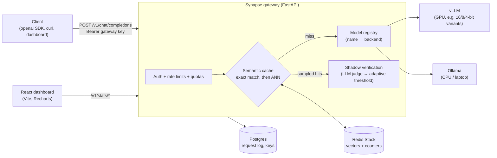

# Synapse

[](https://github.com/arvindxyogesh/Synapse/actions/workflows/ci.yml)
[](https://arvindxyogesh.github.io/Synapse/)
[](LICENSE)

**Synapse is a self-hosted, OpenAI-compatible gateway for open-weight LLMs:
point the unmodified `openai` SDK at it and get semantic response caching,
per-key rate limits and quotas, cost and latency tracking, and a dashboard,
in front of Ollama or vLLM.** This repo also measures what 4-bit and 8-bit
weight quantization buys and costs when serving Qwen2.5-7B through vLLM
behind the gateway, on a real GPU, with every number reproducible from data
committed here.

### ▶ [Live demo: arvindxyogesh.github.io/Synapse](https://arvindxyogesh.github.io/Synapse/)

The demo is a static site (no server, no GPU), so it shows **recorded**
results: the benchmark dashboard, and a Playground that replays real requests
through the gateway with their original timing. To run the live gateway, see
[Quickstart](#quickstart).

<table>
<tr>
<td width="58%"></td>
<td width="42%"></td>
</tr>
<tr>
<td>Benchmarks page (from the recorded GPU runs)</td>
<td>Replay: a miss, then an exact and a reworded cache hit</td>
</tr>
</table>

## Quantization results

Qwen2.5-7B-Instruct at three weight precisions (the Qwen team's own
checkpoints, pinned revisions), served one at a time by vLLM on the same
whole GPU with identical settings, measured through the gateway and directly.

<!-- BEGIN GENERATED RESULTS (python -m synapse_bench.summarize --readme ...) -->
- **4-bit decodes 3.1× faster than 16-bit for a single request**, but the gap narrows to 1.9× in throughput at 64 concurrent requests.
- **No accuracy difference is detectable** on the 1,319 GSM8K test questions (paired McNemar p ≥ 0.18 for both quantized variants).
- **Smaller weights buy capacity, not just speed:** the KV cache left over fits 155 concurrent 4K-token requests instead of 114.
- **The gateway is cheap at low load and costly at high load:** about 30–32 ms extra time-to-first-token for a single request, but 14–21% of throughput lost at 64 concurrent requests.

| Variant | Weights | Max concurrent 4K-token requests | Decode speed, 1 request | Throughput, 64 requests | GSM8K accuracy [95% CI] | vs 16-bit |
|---|---|---|---|---|---|---|
| 16-bit (BF16) | 14.3 GiB | 114 | 35.8 tok/s | 1,463 tok/s | 91.7% [90.0%, 93.0%] | baseline |
| 8-bit (GPTQ) | 8.3 GiB | 142 | 69.5 tok/s | 2,101 tok/s | 91.9% [90.3%, 93.2%] | +0.2 pts (p = 0.71) |
| 4-bit (AWQ) | 5.3 GiB | 155 | 110.6 tok/s | 2,746 tok/s | 90.7% [89.0%, 92.1%] | -1.0 pts (p = 0.18) |

**Gateway overhead** (same requests through Synapse vs. straight to vLLM):

| Variant | TTFT p50, 1 request | TTFT p50, 64 requests | Throughput lost, 1 / 4 / 16 / 64 requests |
|---|---|---|---|
| 16-bit (BF16) | 36 → 68 ms | 508 → 2,352 ms | 1% / 1% / 1% / 14% |
| 8-bit (GPTQ) | 24 → 54 ms | 808 → 2,105 ms | 1% / 2% / 3% / 18% |
| 4-bit (AWQ) | 18 → 48 ms | 654 → 2,140 ms | 1% / 3% / 6% / 21% |

*NVIDIA A40, vLLM 0.31.0, Great Lakes (U-M). Speed: run `2026-10-09T1514_perf` (commit `00f5b3a`, 2026-10-09); accuracy and memory: run `2026-10-09T0124_full` (commit `4f42b29`). Every request generates exactly 256 tokens; 100 measured requests per level. Full tables, spread across repeats, and a second-GPU check: [`benchmarks/results/RESULTS.md`](benchmarks/results/RESULTS.md).*
<!-- END GENERATED RESULTS -->

The tables above are generated by `benchmarks/synapse_bench/summarize.py`
from the raw result folders, and a test fails if they're edited by hand or go
stale. The method is [below](#how-the-benchmark-works).

## Architecture


```mermaid
flowchart LR
    client["Client<br/>(openai SDK, curl, dashboard)"] -->|"POST /v1/chat/completions<br/>Bearer gateway key"| gw

    subgraph gw["Synapse gateway (FastAPI)"]
        direction TB
        auth["Auth + rate limits + quotas"] --> cache{"Semantic cache<br/>exact match, then ANN"}
        cache -->|miss| route["Model registry<br/>(name → backend)"]
        cache -.->|"sampled hits"| judge["Shadow verification<br/>(LLM judge → adaptive threshold)"]
    end

    route --> vllm["vLLM<br/>(GPU, e.g. 16/8/4-bit variants)"]
    route --> ollama["Ollama<br/>(CPU / laptop)"]
    cache <--> redis[("Redis Stack<br/>vectors + counters")]
    gw --> pg[("Postgres<br/>request log, keys")]
    dash["React dashboard<br/>(Vite, Recharts)"] -->|"/v1/stats/*"| gw
```

- **One-line integration.** The real `openai` package works unmodified
  (`base_url="http://localhost:8000/v1"`). That's tested by running the SDK
  itself against the app, for regular calls, streaming, `models.list()`, and
  `stream_options.include_usage`.
- **Semantic cache.** An exact-hash lookup, then vector search (Redis HNSW,
  with a linear-scan fallback) over `sentence-transformers` embeddings. Hits
  cost $0 and come back in milliseconds. A per-request header,
  `x-synapse-cache: bypass`, turns it off.
- **Self-tuning cache threshold.** A sample of cache hits is checked in the
  background by an independent LLM judge ("do these two questions have the
  same answer?"), and a small controller moves the similarity threshold to
  hold a target false-positive rate. It's unit-tested; its behaviour with a
  real judge at scale hasn't been measured in this repo (see
  [Known limitations](#known-limitations)).
- **Several backends at once.** A model registry (`models.toml`) gives each
  model name its own backend, which is how the three quantized variants sit
  behind one gateway.
- **Fails loudly.** A failing backend returns HTTP 502 and is logged as an
  error, never answered by a fake reply
  ([D1](DECISIONS.md#d1-a-failing-backend-returns-an-error-not-a-fake-answer)).
- **Per-key limits.** Requests per minute and a monthly USD quota (429s with
  `Retry-After`), with spend, latency, time-to-first-token and cache hit rate
  on the dashboard.

## Quickstart

**Docker Compose** (Postgres, Redis Stack, gateway, dashboard):

```bash
cp .env.example .env
docker compose up --build
```

- Dashboard: http://localhost:5173
- API: http://localhost:8000 (OpenAPI docs at `/docs`)

With no model running, the compose stack answers with labelled mock replies
(`MOCK_FALLBACK=true`), so everything can be clicked through. For real
answers, run `ollama pull qwen2.5:0.5b && ollama serve`. For a GPU, set
`PROVIDER=vllm` and run `vllm serve <model>` (or
`docker compose --profile vllm up`).

**Try it:**

```bash
# 1. create a gateway key (rate limit and monthly quota are optional)
curl -X POST localhost:8000/v1/admin/keys -H "x-admin-key: change-me-admin-key" \
  -H "Content-Type: application/json" -d '{"name": "dev", "rate_limit_per_minute": 60, "monthly_quota_usd": 5}'

# 2. call it with the real OpenAI SDK -- only base_url changes
python - <<'PY'
import openai
client = openai.OpenAI(api_key="llmgw_...", base_url="http://localhost:8000/v1")
for _ in range(2):  # the second call is a cache hit: $0, milliseconds
    r = client.chat.completions.with_raw_response.create(
        model="qwen2.5:0.5b", messages=[{"role": "user", "content": "What is a semantic cache?"}])
    print(r.headers["x-cache"], r.parse().choices[0].message.content[:60])
PY
```

**Without Docker:** `cd backend && pip install -r requirements.txt && alembic upgrade head && uvicorn app.main:app`
(SQLite by default; plain `redis-server` works, and the cache falls back to
a linear scan), then `cd frontend && npm install && npm run dev`.

**Serving several variants:** copy `models.example.toml` to `models.toml`,
point `MODEL_REGISTRY_PATH` at it, and clients choose by name
(`"model": "qwen2.5-7b-awq"`).

## How the benchmark works

Full details: [`benchmarks/README.md`](benchmarks/README.md). The reasoning
behind each choice: [DECISIONS.md](DECISIONS.md) D8–D17.

| | |
|---|---|
| **Model** | Qwen2.5-7B-Instruct: BF16, GPTQ-Int8 and AWQ (4-bit), all first-party checkpoints at pinned revisions. |
| **Hardware** | One whole NVIDIA A40 (48 GB) on U-M's Great Lakes cluster. All three variants run back to back in **one job, on one physical GPU**, with identical vLLM settings (same memory budget and max length, prefix caching off). |
| **Load** | Closed loop at 1, 4, 16 and 64 concurrent requests, 100 measured requests per level after 10 warm-up, sent through the gateway (cache bypassed) and directly to vLLM. Every request generates **exactly 256 tokens** (`ignore_eos`), so variants are compared on identical work. |
| **Metrics** | Time to first token, end-to-end latency (p50/p95), per-request decode speed, aggregate throughput, requests/s, and cost per 1K tokens at the job's actual billed rate. Failed requests are counted, never dropped. |
| **Memory** | Weight memory and KV-cache capacity read from vLLM's own log. `nvidia-smi` alone shows about 90% used for every variant, because vLLM reserves memory up front ([D11](DECISIONS.md)). |
| **Quality** | All 1,319 GSM8K test questions, greedy decoding, exact match on the final `\boxed{}` answer, 95% Wilson intervals, and a paired McNemar test against 16-bit. |
| **Checks** | A run is marked invalid if any response skipped the cache bypass, came from the mock or the cache, or lacked token counts. It warns if the backend reused cached prompt tokens, or if the load generator's CPU was saturated. For the two variants measured in two separate full runs, on two different A40s, direct throughput matched within 0.7%. |

Total GPU spend for every run in this repo (smoke tests, two failed runs and
the fixes they forced, and the final runs) was about **$2**: 9.2 A40-hours on
Great Lakes, plus a few cents on Modal.

**Reproduce:** `benchmarks/gpu_session.py` runs the whole session on any
Linux machine with an NVIDIA GPU. `benchmarks/greatlakes/run_session.sbatch`
and `benchmarks/modal_gpu_session.py` wrap it for Slurm and Modal.
`python -m synapse_bench.summarize` regenerates every table from the raw
results.

### What running it on real hardware found

The benchmark caught problems that tests and laptop runs didn't, each written
up in [DECISIONS.md](DECISIONS.md):

- **The gateway failed 68–75% of requests at 64 concurrent streams** in the
  first full run. A change from milestone 1 had requests hold a database
  connection while waiting for the model's first token, and the blocking
  pool checkout froze the event loop. Two other suspects were ruled out by
  tests before the real cause was found. After the fix: 0 failures (D16).
- **A false "the gateway is 10× slower" result** on the laptop dry run was
  really Ollama's prompt cache favouring whichever target ran second (D12).
- **GSM8K was scoring answer *format*, not maths**, until the prompt used
  Qwen's own `\boxed{}` convention (D13). A 512-token cap was also cutting off
  about 2% of genuine solutions (D15).
- **Libraries quietly wrote to home directories on shared university
  machines**: FlashInfer, TileLang and vLLM's usage statistics. Found by
  checking home after each run, and now checked automatically (D14).

## Known limitations

**Benchmark**
- **Narrow scope:** one model, one GPU type (A40), one quality task (GSM8K,
  zero-shot). The results say nothing about other tasks, long contexts or
  newer GPUs.
- **Short prompts:** the speed workload's prompts are short (median about 15
  tokens), so runs mostly measure decoding; time to first token mostly
  reflects queueing, not prompt processing.
- **Prefix caching off:** it's off on purpose for fair comparisons, but
  production deployments usually turn it on.
- **Concurrency up to 64**, and cost assumes the GPU stays that busy.

**Gateway**
- **Throughput at high load:** it's a single Python process doing
  synchronous database and embedding work on its event loop. At 64
  concurrent requests that costs a noticeable share of throughput (the
  gateway-overhead table above). Measured, not yet fixed.
- **Cache key:** the cache key ignores `temperature`, and requests that set
  `max_tokens` bypass the cache entirely (D2).
- **Self-tuning threshold:** it's tested with unit tests and a deterministic
  judge. Earlier GPU experiments with it were removed from this README
  because their raw data was never committed.

**Demo**
- **Recorded, not live:** the public site is a static replay. Its Playground
  answers come from a 0.5B model on a laptop and are sometimes wrong; the
  page says so.

## Project layout

```
backend/            FastAPI gateway: providers, model registry, semantic cache,
                    adaptive threshold, rate limits/quotas, stats API (Alembic, pytest)
frontend/           React + TypeScript dashboard (Vite, Tailwind, Recharts);
                    `npm run build:demo` builds the static demo
benchmarks/         the quantization benchmark: load generator, metrics, GSM8K eval,
                    GPU session runners (any Linux GPU, Great Lakes, Modal),
                    raw results/ and the generated RESULTS.md
scripts/            record_replay.py (demo recordings), capture_demo_media.py (README images)
docs/PLAN.md        the plan this upgrade followed
DECISIONS.md        every real trade-off, in plain language (D1–D18)
```

## Tests

```bash
cd backend && pip install -r requirements-dev.txt && ruff check app tests && pytest
cd benchmarks && pip install -r requirements.txt && ruff check . && pytest
cd frontend && npm ci && npm run lint && npm test && npm run build
```

CI runs all of it on every push. The backend suite runs on both SQLite and
Postgres 16, with `alembic check` against the models. Test highlights:
- the real `openai` SDK against the app;
- a real-server test that no database connection is held while waiting for
  a model;
- benchmark metrics checked against hand-computed values;
- generated results pinned to the raw data.

## Contributing

See [CONTRIBUTING.md](CONTRIBUTING.md). Issues and PRs welcome.

## License

[MIT](LICENSE). The benchmark's prompt workload is derived from
databricks-dolly-15k (CC BY-SA 3.0) and its eval set is GSM8K (MIT); see
[`benchmarks/workloads/SOURCES.md`](benchmarks/workloads/SOURCES.md).
